# テーブル定義（テキストER）

## ER概要

```mermaid
erDiagram
  tenants {
    uuid id PK "tenant identifier"
    varchar name "display name"
    varchar plan "free, standard, pro"
    varchar status "trial, active, suspended"
    datetime created_at "created timestamp"
    datetime updated_at "updated timestamp"
  }

  users {
    uuid id PK "user identifier"
    uuid tenant_id FK "tenant scope"
    varchar name "nullable display name"
    varchar email "login email, unique per tenant"
    varchar password_hash "hashed password only"
    varchar role "tenant_admin, tenant_user"
    boolean is_active "login and authorization availability"
    datetime created_at "created timestamp"
    datetime updated_at "updated timestamp"
  }

  invitations {
    uuid id PK "invitation identifier"
    uuid tenant_id FK "tenant scope"
    varchar email "invited email"
    varchar role "tenant role granted on accept"
    uuid group_id FK "nullable initial space"
    varchar group_role "nullable space role"
    varchar token UK "one-time invitation token"
    varchar status "pending, accepted, expired, revoked"
    uuid invited_by_user_id FK "inviter"
    datetime expires_at "expiration deadline"
    datetime created_at "created timestamp"
  }

  password_reset_tokens {
    uuid id PK "reset token identifier"
    uuid tenant_id FK "tenant scope"
    uuid user_id FK "target user"
    varchar email "target email at request time"
    varchar token UK "single-use reset token"
    datetime expires_at "expiration deadline"
    datetime used_at "nullable consumed timestamp"
    datetime created_at "created timestamp"
  }

  groups {
    uuid id PK "space identifier"
    uuid tenant_id FK "tenant scope"
    varchar name "space name, unique per tenant"
    varchar description "nullable description"
    uuid created_by_user_id FK "creator"
    datetime created_at "created timestamp"
    datetime updated_at "updated timestamp"
  }

  group_members {
    uuid id PK "membership identifier"
    uuid tenant_id FK "tenant scope"
    uuid group_id FK "space"
    uuid user_id FK "member user"
    varchar role "admin or user within the space"
    uuid invited_by_user_id FK "inviter"
    datetime created_at "created timestamp"
    datetime updated_at "updated timestamp"
  }

  form_definitions {
    uuid id PK "form definition identifier"
    uuid tenant_id FK "tenant scope"
    uuid group_id FK "owning space"
    varchar name "form name"
    varchar description "nullable description"
    varchar status "draft, published, archived"
    varchar archived_from_status "nullable previous status before archive"
    uuid created_by_user_id FK "creator"
    datetime created_at "created timestamp"
    datetime updated_at "updated timestamp"
  }

  form_fields {
    uuid id PK "field identifier"
    uuid tenant_id FK "tenant scope"
    uuid form_definition_id FK "owning form"
    varchar field_key "stable key, unique within form"
    varchar label "display label"
    varchar field_type "text, textarea, number, date, select, radio, checkbox"
    boolean required "required input flag"
    varchar placeholder "nullable input hint"
    varchar help_text "nullable guidance"
    json options_json "nullable options for choice fields"
    int sort_order "display order"
    datetime created_at "created timestamp"
    datetime updated_at "updated timestamp"
  }

  approval_flows {
    uuid id PK "approval flow identifier"
    uuid tenant_id FK "tenant scope"
    uuid group_id FK "owning space"
    varchar name "flow name"
    boolean is_active "selected route availability"
    datetime created_at "created timestamp"
    datetime updated_at "updated timestamp"
  }

  approval_steps {
    uuid id PK "approval step identifier"
    uuid tenant_id FK "tenant scope"
    uuid group_id FK "owning space"
    uuid approval_flow_id FK "parent flow"
    int step_order "sequence within flow"
    varchar step_name "display name"
    uuid assignee_user_id FK "primary assignee"
    json assignee_user_ids "nullable multi-assignee list"
    boolean can_return "whether return is allowed"
    datetime created_at "created timestamp"
    datetime updated_at "updated timestamp"
  }

  applications {
    uuid id PK "application identifier"
    uuid tenant_id FK "tenant scope"
    uuid group_id FK "owning space"
    uuid applicant_user_id FK "nullable submitter user"
    varchar applicant_email "submitter email snapshot"
    uuid form_definition_id FK "submitted form definition"
    uuid approval_flow_id FK "approval route snapshot"
    int current_step_order "nullable active approval step"
    varchar status "draft, published, submitted, in_review, returned, approved, rejected"
    datetime submitted_at "nullable submitted timestamp"
    datetime created_at "created timestamp"
    datetime updated_at "updated timestamp"
  }

  application_field_values {
    uuid id PK "field value identifier"
    uuid tenant_id FK "tenant scope"
    uuid application_id FK "parent application"
    uuid form_field_id FK "source field"
    json value_json "typed submitted value"
    datetime created_at "created timestamp"
    datetime updated_at "updated timestamp"
  }

  application_approvals {
    uuid id PK "approval action identifier"
    uuid tenant_id FK "tenant scope"
    uuid application_id FK "target application"
    uuid approval_step_id FK "approval step"
    uuid acted_by_user_id FK "actor"
    varchar action "approved, returned, rejected"
    varchar comment "nullable actor comment"
    datetime acted_at "action timestamp"
  }

  correction_requests {
    uuid id PK "correction request identifier"
    uuid tenant_id FK "tenant scope"
    uuid application_id FK "target application"
    uuid requested_by_user_id FK "requesting approver"
    varchar status "open, resolved"
    varchar overall_comment "nullable request summary"
    datetime created_at "created timestamp"
    datetime resolved_at "nullable resolution timestamp"
    datetime updated_at "updated timestamp"
  }

  correction_request_items {
    uuid id PK "correction item identifier"
    uuid tenant_id FK "tenant scope"
    uuid correction_request_id FK "parent correction request"
    uuid form_field_id FK "field requiring correction"
    varchar comment "nullable field-level comment"
    boolean is_resolved "field-level resolution flag"
    datetime created_at "created timestamp"
    datetime updated_at "updated timestamp"
  }

  export_jobs {
    uuid id PK "export job identifier"
    uuid tenant_id FK "tenant scope"
    uuid group_id FK "owning space"
    uuid requested_by_user_id FK "requesting user"
    varchar status "queued, processing, completed, failed"
    json filter_json "nullable export filter"
    varchar file_path "nullable generated CSV path"
    datetime started_at "nullable processing start"
    datetime finished_at "nullable processing end"
    datetime created_at "created timestamp"
  }

  audit_logs {
    uuid id PK "audit log identifier"
    uuid tenant_id FK "tenant scope"
    uuid group_id FK "nullable related space"
    uuid actor_user_id FK "nullable actor"
    varchar action_type "business event name"
    varchar target_type "audited resource type"
    varchar target_id "nullable audited resource id"
    json metadata_json "nullable event metadata"
    datetime created_at "event timestamp"
  }

  tenants ||--o{ users : owns
  tenants ||--o{ groups : owns
  tenants ||--o{ invitations : owns
  tenants ||--o{ password_reset_tokens : scopes
  tenants ||--o{ audit_logs : records

  users ||--o{ group_members : joins
  users ||--o{ invitations : invites
  users ||--o{ password_reset_tokens : resets
  users ||--o{ applications : submits
  users ||--o{ application_approvals : acts

  groups ||--o{ group_members : has
  groups ||--o{ form_definitions : has
  groups ||--o{ approval_flows : has
  groups ||--o{ applications : has
  groups ||--o{ export_jobs : has

  form_definitions ||--o{ form_fields : defines
  form_definitions ||--o{ applications : receives

  approval_flows ||--o{ approval_steps : contains
  approval_flows ||--o{ applications : routes
  approval_steps ||--o{ application_approvals : produces

  applications ||--o{ application_field_values : stores
  applications ||--o{ application_approvals : records
  applications ||--o{ correction_requests : receives
  correction_requests ||--o{ correction_request_items : contains
  form_fields ||--o{ application_field_values : captures
  form_fields ||--o{ correction_request_items : targets
```

## 主要テーブル分類

| 分類 | テーブル | 役割 |
| --- | --- | --- |
| テナント基盤 | `tenants`, `users`, `invitations`, `password_reset_tokens` | 組織、ユーザー、招待、パスワード再設定を管理する。 |
| スペース管理 | `groups`, `group_members` | スペースとスペース単位のロールを管理する。 |
| フォーム定義 | `form_definitions`, `form_fields` | 申請フォームの構造を管理する。 |
| 承認定義 | `approval_flows`, `approval_steps` | フォームごとの承認ルートを管理する。 |
| 申請実行 | `applications`, `application_field_values`, `application_approvals` | 申請データ、入力値、承認操作を保持する。 |
| 差し戻し | `correction_requests`, `correction_request_items` | 差し戻し理由と修正対象フィールドを保持する。 |
| 運用 | `export_jobs`, `audit_logs` | CSV出力ジョブと監査ログを管理する。 |

## 項目表記の読み方

- `PK` は主キー、`FK` は外部キー、`UK` は一意キーを示す。
- `tenant_id` はテナント所有データの分離境界であり、業務テーブルの検索・更新では認証済みユーザーのテナントで必ず絞り込む。
- `group_id` はスペース境界であり、フォーム、承認フロー、申請、CSV出力などの業務データをスペース単位で分離する。
- `*_json` は PostgreSQL では `json` 型、一部カラムは TypeORM の `simple-json` で保持する。
- `created_at` / `updated_at` は TypeORM の自動日時カラムで、業務イベントの発生時刻を明示したい場合は `acted_at` や `submitted_at` などの専用カラムを使う。

## tenants
- id: string (PK)
- name: string
- plan: enum(free, standard, pro)
- status: enum(trial, active, suspended)
- created_at: datetime
- updated_at: datetime

同一 `tenant_id` / `group_id` に複数のフォーム定義を保持できる。申請レコードは作成時に利用した `form_definition_id` を保持する。

## users
- id: string (PK)
- tenant_id: string (FK -> tenants.id)
- name: string nullable
- email: string
- password_hash: string
- role: enum(tenant_admin, tenant_user)
- is_active: boolean
- created_at: datetime
- updated_at: datetime

`users.email` は `tenant_id` と合わせて一意にする。同じメールアドレスでも別テナントでは別ユーザーとして扱える。

## password_reset_tokens
- id: string (PK)
- tenant_id: string (FK -> tenants.id)
- user_id: string (FK -> users.id)
- email: string
- token: string (unique)
- expires_at: datetime
- used_at: datetime nullable
- created_at: datetime

パスワード再設定はテナントとユーザーに紐づけ、`token` は一意な単回利用トークンとして扱う。`used_at` が入ったトークンは再利用できない。

## invitations
- id: string (PK)
- tenant_id: string (FK -> tenants.id)
- email: string
- role: enum(tenant_admin, tenant_user)
- group_id: string nullable (FK -> groups.id)
- group_role: enum(admin, user) nullable
- token: string
- status: enum(pending, accepted, expired, revoked)
- invited_by_user_id: string (FK -> users.id)
- expires_at: datetime
- created_at: datetime

## groups
- id: string (PK)
- tenant_id: string (FK -> tenants.id)
- name: string
- description: string nullable
- created_by_user_id: string (FK -> users.id)
- created_at: datetime
- updated_at: datetime

## group_members
- id: string (PK)
- tenant_id: string (FK -> tenants.id)
- group_id: string (FK -> groups.id)
- user_id: string (FK -> users.id)
- role: enum(admin, user)
- invited_by_user_id: string (FK -> users.id)
- created_at: datetime
- updated_at: datetime

`group_members.role` はスペースごとのロールであり、同じユーザーでもスペースごとに異なる値を持てる。例: A スペースでは `admin`、B スペースでは `user`。

## form_definitions
- id: string (PK)
- tenant_id: string (FK -> tenants.id)
- group_id: string (FK -> groups.id)
- name: string
- description: string nullable
- status: enum(draft, published, archived)
- archived_from_status: enum(draft, published) nullable
- created_by_user_id: string (FK -> users.id)
- created_at: datetime
- updated_at: datetime

## form_fields
- id: string (PK)
- tenant_id: string (FK -> tenants.id)
- form_definition_id: string (FK -> form_definitions.id)
- field_key: string
- label: string
- field_type: enum(text, textarea, number, date, select, radio, checkbox)
- required: boolean
- placeholder: string nullable
- help_text: string nullable
- options_json: json nullable
- sort_order: int
- created_at: datetime
- updated_at: datetime

## approval_flows
- id: string (PK)
- tenant_id: string (FK -> tenants.id)
- group_id: string (FK -> groups.id)
- name: string
- is_active: boolean
- created_at: datetime
- updated_at: datetime

承認フローはスペースに属する。申請作成時に `applications.form_definition_id` と `applications.approval_flow_id` の組み合わせとして、利用したフォームと承認ルートを固定する。

## approval_steps
- id: string (PK)
- tenant_id: string (FK -> tenants.id)
- group_id: string (FK -> groups.id)
- approval_flow_id: string (FK -> approval_flows.id)
- step_order: int
- step_name: string
- assignee_user_id: string (FK -> users.id)
- assignee_user_ids: json/text nullable
- can_return: boolean
- created_at: datetime
- updated_at: datetime

## applications
- id: string (PK)
- tenant_id: string (FK -> tenants.id)
- group_id: string (FK -> groups.id)
- applicant_user_id: string nullable (FK -> users.id)
- applicant_email: string
- form_definition_id: string (FK -> form_definitions.id)
- approval_flow_id: string (FK -> approval_flows.id)
- current_step_order: int nullable
- status: enum(draft, published, submitted, in_review, returned, approved, rejected) — `submitted` は DB 互換用。実行時の提出・再提出は `in_review` に直接遷移する
- submitted_at: datetime nullable
- created_at: datetime
- updated_at: datetime

## application_field_values
- id: string (PK)
- tenant_id: string (FK -> tenants.id)
- application_id: string (FK -> applications.id)
- form_field_id: string (FK -> form_fields.id)
- value_json: json
- created_at: datetime
- updated_at: datetime

## application_approvals
- id: string (PK)
- tenant_id: string (FK -> tenants.id)
- application_id: string (FK -> applications.id)
- approval_step_id: string (FK -> approval_steps.id)
- acted_by_user_id: string (FK -> users.id)
- action: enum(approved, returned, rejected)
- comment: string nullable
- acted_at: datetime

## correction_requests
- id: string (PK)
- tenant_id: string (FK -> tenants.id)
- application_id: string (FK -> applications.id)
- requested_by_user_id: string (FK -> users.id)
- status: enum(open, resolved)
- overall_comment: string nullable
- created_at: datetime
- resolved_at: datetime nullable
- updated_at: datetime

## correction_request_items
- id: string (PK)
- tenant_id: string (FK -> tenants.id)
- correction_request_id: string (FK -> correction_requests.id)
- form_field_id: string (FK -> form_fields.id)
- comment: string nullable
- is_resolved: boolean
- created_at: datetime
- updated_at: datetime

## export_jobs
- id: string (PK)
- tenant_id: string (FK -> tenants.id)
- group_id: string (FK -> groups.id)
- requested_by_user_id: string (FK -> users.id)
- status: enum(queued, processing, completed, failed)
- filter_json: json nullable
- file_path: string nullable
- started_at: datetime nullable
- finished_at: datetime nullable
- created_at: datetime

## audit_logs
- id: string (PK)
- tenant_id: string (FK -> tenants.id)
- group_id: string nullable (FK -> groups.id)
- actor_user_id: string nullable (FK -> users.id)
- action_type: string
- target_type: string
- target_id: string nullable
- metadata_json: json nullable
- created_at: datetime

## インデックス方針
- users: unique(tenant_id, email)
- password_reset_tokens: unique(token), index(email)
- groups: unique(tenant_id, name)
- group_members: unique(group_id, user_id), index(tenant_id, user_id)
- form_definitions: index(tenant_id, group_id)
- form_fields: unique(form_definition_id, field_key), index(tenant_id, form_definition_id)
- approval_flows: index(tenant_id, group_id)
- approval_steps: unique(approval_flow_id, step_order)
- applications: index(tenant_id, group_id, status, created_at)
- application_field_values: unique(application_id, form_field_id)
- application_approvals: index(application_id)
- correction_requests: index(application_id)
- correction_request_items: index(correction_request_id)
- export_jobs: index(tenant_id, group_id, status, created_at)
- audit_logs: index(tenant_id, group_id, created_at), index(tenant_id, created_at)
