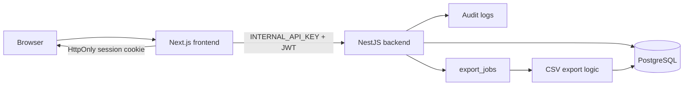

# 全体構成

- Next.js: 画面表示、フォーム入力、認証後UI、Server Actions 経由の API 呼び出し
- NestJS: 認証、業務ロジック、認可、監査ログ、CSVジョブ管理
- PostgreSQL: 永続化
- CSV 生成: `export_jobs` テーブルでジョブ状態を管理し、現状は API リクエスト内で同期的に CSV を生成する

## レイヤー責務

| レイヤー | 責務 | 置かないもの |
| --- | --- | --- |
| Next.js frontend | 画面、フォーム、Server Actions、BFF経由のAPI呼び出し | 認可の最終判断、DBアクセス、ブラウザに出す秘密情報 |
| NestJS backend | 業務ルール、認証、認可、バリデーション、永続化、監査ログ | UI都合の状態管理、クライアント入力のtenantId信頼 |
| Database | テナントスコープ付き業務データの永続化 | 業務フローの判断ロジック |
| Export logic | `export_jobs` を処理して CSV を生成 | 将来、別ワーカーへの切り出しを想定したジョブモデル |

## フロントエンド構成方針
- App Router を採用
- server component / client component を適切に分離
- API呼び出しは型安全なクライアントを用意
- 動的フォームは FormDefinition と FormField 定義から生成

## バックエンド構成方針
- NestJS module 単位に責務分離
- DTO + class-validator を利用
- TypeORM をデータアクセス層に使う
- 監査ログは重要操作のたびに明示的に記録

## 非同期処理方針
MVPでは簡易的に DB ベースの export_jobs を利用する。
- APIでジョブ作成
- ポーリングで状態確認
- 完了後にダウンロード
