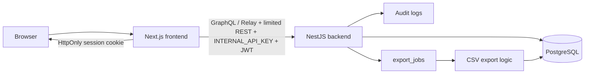

# 全体構成

- Next.js: 画面表示、フォーム入力、認証後UI、Relay / Server Actions / Route Handler 経由の API 呼び出し
- NestJS: 認証、業務ロジック、認可、監査ログ、CSVジョブ管理
- PostgreSQL: 永続化
- CSV 生成: `export_jobs` テーブルでジョブ状態を管理し、現状は API リクエスト内で同期的に CSV を生成する

## レイヤー責務

| レイヤー | 責務 | 置かないもの |
| --- | --- | --- |
| Next.js frontend | 画面、フォーム、Server Actions、BFF経由のAPI呼び出し | 認可の最終判断、DBアクセス、ブラウザに出す秘密情報 |
| NestJS backend | 業務ルール、認証、認可、バリデーション、永続化、監査ログ | UI都合の状態管理、クライアント入力のtenantId信頼 |
| Database | テナントスコープ付き業務データの永続化 | 業務フローの判断ロジック |
| Export logic | `export_jobs` を処理して CSV を生成 | 将来、別ワーカーへの切り出しを想定したジョブモデル |

## 変更時に守る不変条件

ReviewFlow の変更では、以下を崩さないことを優先する。

- バックエンドが最終的な認可境界である。フロントエンドのボタン非表示やルーティング制御だけで許可判定を完結させない。
- `tenantId` は認証コンテキストまたは申請者アクセストークンから解決し、URL や body の値を信頼しない。
- space 業務データは `tenantId` と `groupId` の両方でスコープする。
- 承認、差し戻し、再提出、却下は、現在ステータスと現在承認ステップに基づいて判定する。
- 状態遷移、認可、入力検証、永続化、レスポンス整形、監査ログ記録を同じ関数や Controller に詰め込まない。
- 複数テーブルを同時に更新する業務操作では、必要に応じて transaction を使う。
- 重要な業務操作は audit log に残し、Pino のリクエストログとは目的を分ける。
- API 契約を変えた場合は GraphQL / Relay operation と共有 DTO 型を更新する。REST 契約を変えた場合は Swagger / OpenAPI 参照スキーマも更新する。
- 認証後 UI の主要な業務データ取得・更新は GraphQL / Relay を正とする。REST は運用、ファイル、公開入口、外部互換など用途を限定して残す。
- REST と GraphQL の両方で同じ操作を公開する場合でも、Controller / Resolver は薄く保ち、同じ Service / Use case に委譲する。

## フロントエンド構成方針
- App Router を採用
- server component / client component を適切に分離
- 認証後 UI の主要な API 呼び出しは Relay operation / fragment を優先する
- Browser Relay は Next.js Route Handler 経由で backend に中継し、`INTERNAL_API_KEY` をブラウザへ出さない
- 動的フォームは FormDefinition と FormField 定義から生成

## バックエンド構成方針
- NestJS module 単位に責務分離
- DTO + class-validator を利用
- TypeORM をデータアクセス層に使う
- 監査ログは重要操作のたびに明示的に記録
- GraphQL resolver と REST controller は request / response の境界にとどめ、業務判断は service / policy / validator / workflow に置く

## 非同期処理方針
MVPでは簡易的に DB ベースの export_jobs を利用する。
- APIでジョブ作成
- ポーリングで状態確認
- 完了後にダウンロード
