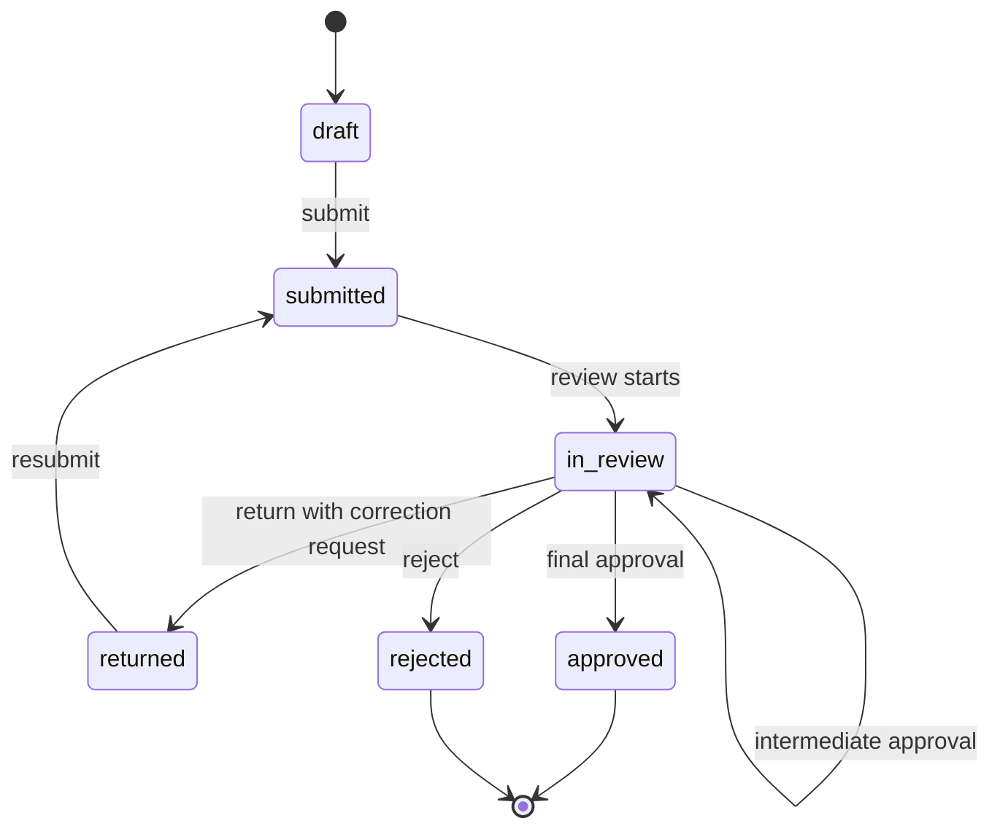

# 申請ステータス

- draft
- submitted
- in_review
- returned
- approved
- rejected

| ステータス | 意味 | 主な遷移元 | 主な遷移先 |
| --- | --- | --- | --- |
| `draft` | 申請の下書き | 新規作成 | `submitted` |
| `submitted` | 申請者が提出済み | `draft`, `returned` | `in_review` |
| `in_review` | 承認者による確認中 | `submitted`, 中間承認 | `returned`, `approved`, `rejected`, 次ステップの `in_review` |
| `returned` | 修正依頼付きで差し戻し | `in_review` | `submitted` |
| `approved` | 最終承認済み | `in_review` | 終了 |
| `rejected` | 却下済み | `in_review` | 終了 |

## 基本フロー
1. テナントユーザーが申請作成
2. draft 保存
3. submit で submitted
4. 承認処理開始で in_review
5. 承認 or 差し戻し or 却下
6. 最終承認で approved

## 想定される業務の流れ

ReviewFlow は、フォームや承認経路を事前に定義してから、申請・承認・差し戻し・再提出・集計までを同じテナント内で完結させる。ここでは、小規模から中規模組織でよくある「経費申請」「稟議申請」「入退社手続き申請」のような業務を想定する。

### 1. 利用準備

1. テナント管理者が組織用のテナントにログインする。
2. テナント管理者が申請業務に参加するユーザーを招待する。
3. テナント管理者またはスペース管理者が、部署や業務単位に対応するスペースを作成する。
4. スペース管理者が、スペースに参加するユーザーを管理する。

この段階では、ユーザーのテナントロールとスペース参加ロールを分けて扱う。テナント管理者はユーザー招待や監査ログ確認を行い、スペース管理者は担当スペース内の申請フォームや参加者を管理する。

### 2. 申請フォームと承認フローの準備

1. スペース管理者または権限を持つテナントユーザーが、業務に必要な申請フォームを作成する。
2. フォーム項目として、申請理由、金額、対象日、添付情報、備考など、業務ごとの入力項目を設定する。
3. フォームに対して承認フローを定義する。
4. 承認ステップごとに、承認順序と承認担当者を割り当てる。
5. フォーム内容と承認フローを確認し、申請者が利用できる状態として公開する。

MVPでは、承認フローは直列承認のみを扱う。たとえば「直属上長 -> 部門長 -> 経理担当」のように、前のステップが承認されると次のステップへ進む。

### 3. 申請作成と提出

1. 申請者が申請フォーム画面へアクセスする。
2. 申請者がフォーム項目に入力し、必要に応じて下書き保存する。
3. 入力内容が揃ったら申請者が提出する。
4. 申請は `submitted` になり、承認対象として扱われる。
5. 承認処理が開始されると、申請は最初の承認ステップの `in_review` になる。

下書き状態の申請は申請者の作業途中のデータであり、承認者の確認対象にはしない。提出後の申請だけを承認待ちとして扱う。

### 4. 承認者による確認

1. 現在ステップに割り当てられた承認者が、承認待ち一覧から申請を開く。
2. 承認者が申請内容、入力項目、過去の承認履歴、差し戻し履歴を確認する。
3. 内容に問題がなければ承認する。
4. 次の承認ステップがある場合、申請は次の担当者の `in_review` に進む。
5. 最終ステップで承認された場合、申請は `approved` になる。

承認権限は、現在ステップの承認者割り当てとテナント一致で判定する。フロントエンドでボタンを非表示にしても、最終的な権限判定はバックエンドで行う。

### 5. 差し戻しと再提出

1. 承認者が内容の修正を求める場合、差し戻しを選択する。
2. 承認者は全体コメントに加えて、修正が必要なフォーム項目を1つ以上指定する。
3. 申請は `returned` になり、修正依頼が作成される。
4. 申請者は差し戻し内容を確認し、指定された項目だけを編集する。
5. 申請者が再提出すると、修正依頼は解決済みになり、申請は再び `submitted` になる。
6. 承認処理が再開され、承認者は修正後の内容を確認する。

差し戻し時は「どの項目を直すべきか」を明示する。修正対象外の項目は読み取り専用にし、再提出時に不要な変更が混ざることを避ける。

### 6. 却下と終了

1. 承認者が申請を受け付けられないと判断した場合、却下する。
2. 申請は `rejected` になり、承認フローは終了する。
3. 却下済みの申請は再提出対象にはしない。

差し戻しは「修正すれば再審査できる」場合に使い、却下は「この申請としては完了できない」場合に使う。

### 7. 進捗確認、CSV出力、監査

1. 申請者は自分の申請の状態を確認する。
2. 承認者は自分に割り当てられた承認待ち申請を確認する。
3. スペース管理者またはテナント管理者は、スペース内の申請状況を確認する。
4. 必要に応じて申請データをCSVとして出力する。
5. テナント管理者は、申請件数、差し戻し回数、再提出件数などの利用状況を管理画面で確認する。
6. 重要な操作は監査ログとして記録し、後から誰がいつ何を行ったかを追跡できるようにする。

CSV出力や管理画面は、業務の完了後に集計や棚卸しを行うための運用機能として扱う。申請・承認の権限判定とは分離し、テナント境界を越えたデータ参照を許可しない。

## 申請作成画面
- スペース配下の新規申請画面は、申請項目と承認ステップを入力して申請フォームを作成・公開する入口である。
- 申請一覧画面では、作成した申請フォーム定義を親として表示し、そのフォームから利用者が提出した個別申請を子としてぶら下げる。
- `draft` / `published` のフォーム作成状態と、利用者から届いた個別申請は同じ一覧上で混在させず、フォーム定義と申請レコードの親子関係が分かる表示にする。
- 申請フォームの削除は物理削除ではなく `archived` への移動として扱う。削除済み一覧から復元すると削除前の `draft` / `published` に戻り、既存申請レコードは保持される。
- フォーム定義画面と承認フロー画面は独立したナビゲーション項目としては持たず、新規申請画面に集約する。

## 承認フロー制約
- 直列承認のみ
- 1フォームに対して1有効フロー
- ステップは step_order で順序管理
- 現在ステップの assignee_user_ids に含まれるユーザーが承認可能。既存データ互換のため assignee_user_ids が未設定の場合は assignee_user_id を代表承認者として扱う。

## 承認ロジック
- 中間承認: 次ステップに進める
- 最終承認: approved
- 差し戻し: returned + correction_request 作成
- 却下: rejected

## 承認権限判定
- 自分のユーザーIDが current step の assignee_user_ids に含まれること
- tenant_id が一致すること
