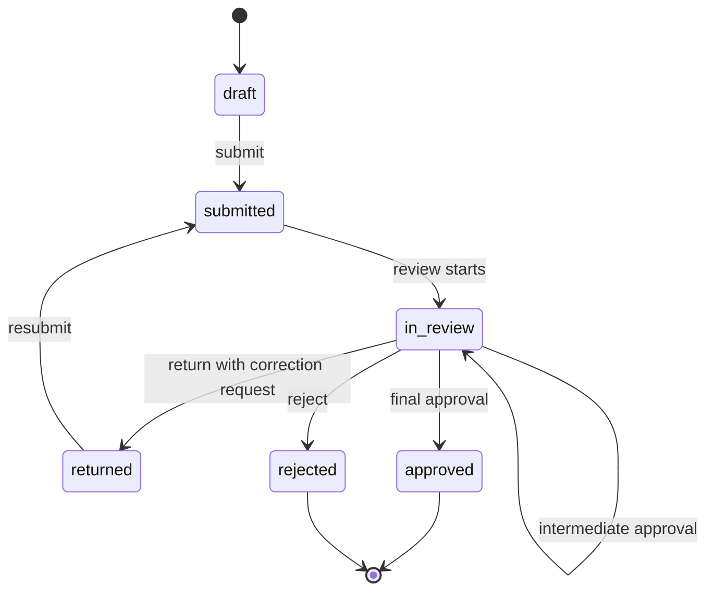

# 申請ステータス

- draft
- submitted
- in_review
- returned
- approved
- rejected

| ステータス | 意味 | 主な遷移元 | 主な遷移先 |
| --- | --- | --- | --- |
| `draft` | 申請の下書き | 新規作成 | `submitted` |
| `submitted` | 申請者が提出済み | `draft`, `returned` | `in_review` |
| `in_review` | 承認者による確認中 | `submitted`, 中間承認 | `returned`, `approved`, `rejected`, 次ステップの `in_review` |
| `returned` | 修正依頼付きで差し戻し | `in_review` | `submitted` |
| `approved` | 最終承認済み | `in_review` | 終了 |
| `rejected` | 却下済み | `in_review` | 終了 |

## 基本フロー
1. テナントユーザーが申請作成
2. draft 保存
3. submit で submitted
4. 承認処理開始で in_review
5. 承認 or 差し戻し or 却下
6. 最終承認で approved

## 申請作成画面
- スペース配下の新規申請画面は、申請項目と承認ステップを入力して申請フォーム定義を作成・公開する入口である。
- 申請一覧画面では、作成した申請フォーム定義を親として表示し、そのフォームから利用者が提出した個別申請を子としてぶら下げる。
- `draft` / `published` のフォーム作成状態と、利用者から届いた個別申請は同じ一覧上で混在させず、フォーム定義と申請レコードの親子関係が分かる表示にする。
- フォーム定義画面と承認フロー画面は独立したナビゲーション項目としては持たず、新規申請画面に集約する。

## 承認フロー制約
- 直列承認のみ
- 1フォームに対して1有効フロー
- ステップは step_order で順序管理
- 現在ステップの assignee_user_ids に含まれるユーザーが承認可能。既存データ互換のため assignee_user_ids が未設定の場合は assignee_user_id を代表承認者として扱う。

## 承認ロジック
- 中間承認: 次ステップに進める
- 最終承認: approved
- 差し戻し: returned + correction_request 作成
- 却下: rejected

## 承認権限判定
- 自分のユーザーIDが current step の assignee_user_ids に含まれること
- tenant_id が一致すること
